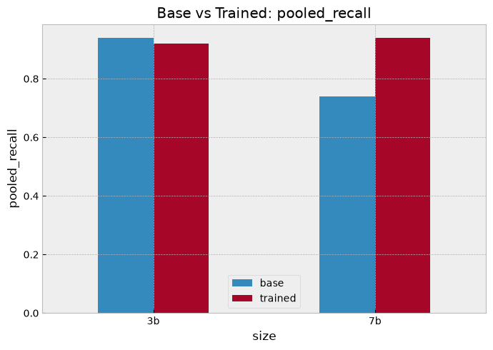
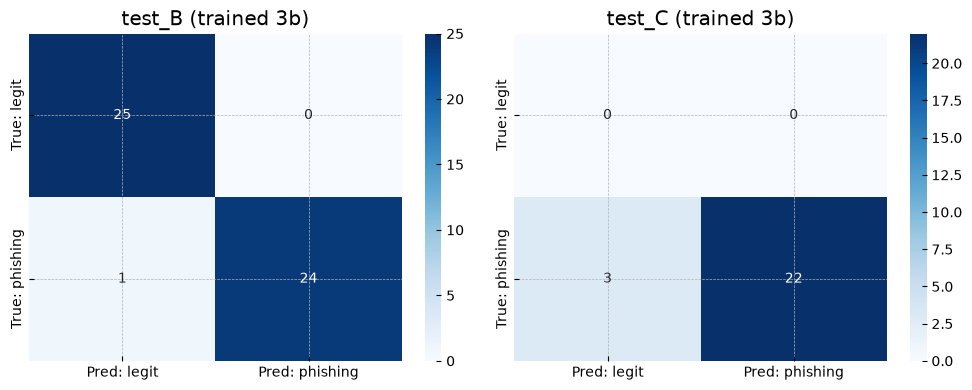
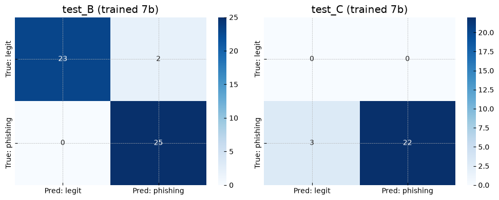

# Phishing Analyzer LoRA

QLoRA adapters for `Qwen2.5-Instruct` (3B and 7B variants) that classify emails as phishing or legitimate and return a structured threat analysis (threat type, risk level, indicators, mitigation recommendations) as JSON.

This is a portfolio / learning project focused on practical LoRA fine-tuning skills, evaluated as rigorously as the available compute and sample sizes allow — see the **Limitations** section before drawing strong conclusions from any single number below.

## Repository Structure

```
.
├── 3b-adapter/
│   ├── adapter_config.json
│   ├── adapter_model.safetensors
│   ├── tokenizer.json
│   ├── tokenizer_config.json
│   └── chat_template.jinja
├── 7b-adapter/
│   ├── adapter_config.json
│   ├── adapter_model.safetensors
│   ├── tokenizer.json
│   ├── tokenizer_config.json
│   └── chat_template.jinja
├── assets/
│   ├── pooled_recall_base_vs_trained.png
│   ├── confusion_matrix_3b.png
│   └── confusion_matrix_7b.png
└── README.md
```

## Model Details

| | 3B adapter | 7B adapter |
|---|---|---|
| Base model | `unsloth/Qwen2.5-3B-Instruct-bnb-4bit` | `unsloth/Qwen2.5-7B-Instruct-bnb-4bit` |
| Adapter type | QLoRA (PEFT `LORA`) | QLoRA (PEFT `LORA`) |
| Rank (r) | 8 | 8 |
| Alpha | 16 | 16 |
| Dropout | 0 | 0 |
| Target modules | `q_proj`, `k_proj`, `v_proj`, `o_proj`, `gate_proj`, `up_proj`, `down_proj` | same |
| Adapter file size | ~58 MB | ~77 MB |
| Trained with | Unsloth (QLoRA), Google Colab (T4) | Unsloth (QLoRA) |
| Epochs | 2 | 2 |
| Context length | 2048 | 2048 |
| Effective batch size | 8 | 8 |
| LR scheduler | cosine, `warmup_ratio=0.03` | cosine, `warmup_ratio=0.03` |
| Weight decay | 0.001 | 0.001 |
| Train/eval split | `train_test_split(test_size=0.1, seed=3407)` | same |
| PEFT version | 0.20.0 | 0.20.0 |

**Note on chat template:** `chat_template.jinja` is the unmodified Qwen2.5 ChatML template — the system prompt used during training/eval is *not* baked in and must be passed explicitly (see below).

## Training Data

- Base corpus: [CEAS-08](https://huggingface.co/datasets/nosadaniel/phishing-email-training-dataset), cleaned and combined with synthetic BEC (business email compromise) / invoice-fraud augmentation into `datasetv3_2048.jsonl` — **2,259 rows** after cleaning.
- Context length was set to 2048 specifically because 1024 tokens truncates and destroys 77–89% of BEC/invoice-fraud examples in this dataset — a shorter context silently drops the exact category the augmentation was meant to fix.
- **Known dataset bias:** CEAS-08 skews toward phishing with technical artifacts (links, attachments), so without augmentation the model under-detects pure social-engineering attacks (BEC, impersonation). The synthetic augmentation targets this gap but does not fully eliminate it.

## Evaluation Methodology

Four models were evaluated on the same two **external** (non-training-distribution) test sets, using an identical, paired evaluation harness:

- **Test B** — Nazario Phishing Corpus + Nigerian Fraud corpus + SpamAssassin ham (50 examples: 25 legitimate / 25 phishing).
- **Test C** — Phishing Pot honeypot corpus, rf-peixoto, CC BY-NC 4.0 (25 examples, **phishing only — no legitimate emails in this set**).
- Combined pooled evaluation: 75 paired examples.
- All four runs (base 3B, trained 3B, base 7B, trained 7B) share an identical evaluation fingerprint (`58b9c22ff94898bc68df95722874547d`), confirming the comparison is over the exact same items — this is what makes the paired McNemar test below valid.
- `FAILURE_IS_WRONG = True`: any parse failure on the base (no-adapter) models counts as an error rather than being excluded, so baseline numbers aren't artificially inflated.

## Results



| Model | Recall (Test B) | FPR (Test B) | Recall (Test C) | Pooled accuracy (n=75) |
|---|---|---|---|---|
| base 3B (no adapter) | 0.960 | **0.240** | 0.920 | 0.880 |
| **3B adapter** | 0.960 | 0.000 | 0.880 | 0.947 |
| base 7B (no adapter) | 0.920 | 0.000 | 0.560 | 0.827 |
| **7B adapter** | 1.000 | 0.080 | 0.880 | 0.933 |

The base 3B model misclassified 6 of 25 legitimate emails as phishing (FPR = 0.24) on Test B. After fine-tuning, FPR drops to 0. This is the single clearest, most consistent effect of the adapter across both model sizes.

### Confusion matrices (trained adapters)

| 3B adapter | 7B adapter |
|---|---|
|  |  |

### Statistical comparison (McNemar's exact test, n=75 paired examples)

| Comparison | Δ accuracy | 95% CI | p-value | Significant? |
|---|---|---|---|---|
| base 3B → 3B adapter (fine-tuning effect, 3B) | +6.7 pp | [−0.1, +13.4] pp | 0.125 | **No** |
| base 7B → 7B adapter (fine-tuning effect, 7B) | +10.7 pp | [+1.9, +19.4] pp | 0.039 | Yes (marginal) |
| base 3B → base 7B (size effect, no fine-tuning) | −5.3 pp | [−15.7, +5.1] pp | 0.455 | No |
| 3B adapter → 7B adapter (size effect, with fine-tuning) | −1.3 pp | [−8.2, +5.6] pp | 1.000 | No |

**Honest read of these numbers, not a sales pitch:**
- Fine-tuning has a positive effect on both model sizes, but is only statistically significant for 7B, and that result (p=0.039) is close enough to the 0.05 threshold with n=75 that it should be treated as suggestive, not conclusive.
- The apparent fine-tuning benefit for 3B (p=0.125) is **not statistically significant** — don't claim it as proven, even though the point estimate and the FPR result both point the same direction.
- Once fine-tuned, 3B and 7B perform statistically indistinguishably (Δ=−1.3pp, p=1.0). There is no evidence the larger base model produces a better adapter here.
- All four CIs are wide. With test sets of 50–75 examples, these are directional findings, not tight estimates — do not over-interpret small point-estimate differences between rows.

### False negative analysis (3B vs 7B adapters)

Manual review of the discordant pairs identified four false negatives, broken down as:
- 1 case attributable to likely label noise in the source corpus.
- 2 cases were near-duplicate templates already present in the training data (a deduplication gap between train and test).
- 1 genuine miss: a Ledger hardware-wallet CVE-impersonation email neither adapter caught.

### Calibration

Confidence scores on incorrect verdicts were observed to run high in some cases — i.e. the models are not well calibrated, and confidence should not be treated as a reliable proxy for correctness. Downstream use should not threshold purely on `confidence_score` without independent calibration.

## Limitations

- **Test C has no legitimate-email examples** (0 of 25) — recall on Test C is measurable, but false-positive rate is not. The "pooled accuracy" figures above mix a balanced test set (Test B) with an unbalanced, phishing-only one (Test C); treat pooled accuracy as a composite metric, not a substitute for balanced accuracy.
- Small external test sets (50–75 examples total) → wide confidence intervals on every comparison above. Do not generalize these exact percentages to production traffic.
- Trained and evaluated on English-language emails only.
- Not evaluated against adversarial or evasion-tuned phishing content.
- Confidence scores are not well calibrated (see above).
- Base model (Qwen2.5) license: listed as Apache 2.0 on the original Unsloth/HF model pages, but this has **not been independently re-verified** for this repo — confirm current licensing terms directly on Hugging Face before any commercial use.

## How to Get Started

```python
from unsloth import FastLanguageModel
import torch, json

# Choose one:
BASE_MODEL = "unsloth/Qwen2.5-3B-Instruct-bnb-4bit"   # or "unsloth/Qwen2.5-7B-Instruct-bnb-4bit"
ADAPTER_DIR = "3b-adapter"                              # or "7b-adapter"

model, tokenizer = FastLanguageModel.from_pretrained(
    model_name=BASE_MODEL,
    max_seq_length=2048,
    load_in_4bit=True,
)
model.load_adapter(ADAPTER_DIR)
FastLanguageModel.for_inference(model)

messages = [
    {
        "role": "system",
        "content": (
            "You are an advanced AI security analyst specialized in email threat detection. "
            "Analyze the provided email and respond with a JSON object containing: "
            "is_phishing, confidence_score, threat_type, risk_level, indicators, "
            "mitigation_recommendations, analysis_summary."
        ),
    },
    {"role": "user", "content": "<email text here>"},
]

inputs = tokenizer.apply_chat_template(
    messages, tokenize=True, add_generation_prompt=True, return_tensors="pt"
).to(model.device)

outputs = model.generate(inputs, max_new_tokens=500, do_sample=False)
response = tokenizer.decode(outputs[0][inputs.shape[-1]:], skip_special_tokens=True)
print(json.loads(response))
```

**Note:** the system prompt above is not baked into `chat_template.jinja` — it must be passed explicitly, for both adapters. Production use should parse the model's JSON output defensively (regex fallback for malformed fields), rather than assuming `json.loads()` will always succeed on greedy-decoded output.

## Output Schema

```json
{
  "is_phishing": true,
  "confidence_score": 0.96,
  "threat_type": "business_email_compromise_invoice_fraud",
  "risk_level": "5",
  "indicators": [
    {"category": "...", "finding": "...", "severity": "4", "explanation": "..."}
  ],
  "mitigation_recommendations": {
    "immediate_actions": ["..."],
    "preventive_measures": ["..."],
    "reporting_guidance": "..."
  },
  "analysis_summary": "..."
}
```

## Repository Contents

**Included:** adapter weights (3B and 7B), tokenizer files, chat template, this README, evaluation charts.

**Not included:**
- Training notebooks / scripts
- Evaluation harness (the paired McNemar comparison code)
- Test sets B and C themselves
- The synthetic BEC/invoice-fraud augmentation generator
- `datasetv3_2048.jsonl` (training data) — not redistributed here; see Training Data section for the CEAS-08 source

## License

Adapters released under Apache 2.0. This inherits the base model's license terms — verify the current Qwen2.5 license on Hugging Face before commercial use (see Limitations). The CEAS-08 source dataset's own license was not independently re-verified for this repo; check the linked source before relying on it.

## Framework Versions

- PEFT 0.20.0
- Trained via Unsloth
